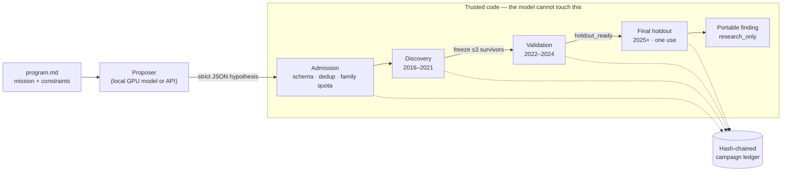

# Autonomous Quant Researcher

**An LLM proposes trading hypotheses. Trusted code decides whether they are true.**

A bounded, resumable research loop for quantitative finance: a language model
proposes candidate hypotheses inside a fixed vocabulary, a deterministic
evaluator tests each one on immutable chronological market data behind a
discovery → validation → one-use holdout wall, and a hash-chained ledger keeps
every trial — including the failures, which are most of them.

What it produces is evidence with provenance. What gets traded on that
evidence is a separate system's decision — and the findings carry the hashes
and limitations that system needs to make it.

**▶ Live demo: [henryzhangpku.github.io/autonomous-quant-researcher](https://henryzhangpku.github.io/autonomous-quant-researcher/)** —
the real engine (`research/v3`, `research/backtest`) running in your browser
under Pyodide, driving the research board on a synthetic tape with a scripted
proposer. One regime is planted in the discovery years and absent afterwards;
watch discovery find it and validation refute it. Nothing leaves your browser.

---

## The idea

Two projects released in 2026 made a simple point about agents: **the agent
is the cheap part; the loop around it is the product.**

| | [Karpathy's `autoresearch`](https://github.com/karpathy/autoresearch) | [Cobus Greyling's Loop Engineering](https://github.com/cobusgreyling/loop-engineering) |
|---|---|---|
| **What it is** | An agent edits one `train.py`, runs a fixed 5-minute training job, keeps the change if the metric improved, discards it otherwise, repeats overnight. The instructions live in a `program.md`, not in code. | A pattern library for the loop itself: `LOOP.md` and `STATE.md` as the persistent contract, explicit budgets, deterministic gates, an audit trail, an earned autonomy ladder, and maker/checker separation. |
| **What I took** | The small, fixed experiment contract — one candidate, one metric, one budget, keep or discard — and the discipline of programming the agent through [`program.md`](program.md) rather than through prompts. | The control surface in [`research/control/`](research/control/) — loop lifecycle, state, [budget](research/control/loop-budget.md), [constraints](research/control/loop-constraints.md), [gate policy](research/control/gate.yaml), and a [run-log contract](research/control/loop-run-log.md) that forbids editing failures away. |

Then I applied it to a domain where the metric lies to you.

### Why a finance loop cannot be an ML loop

In `autoresearch`, if validation loss went down, the change was good. Markets
do not offer that courtesy. A hypothesis that "improves the metric" on
historical data is, by default, one of the following: overfit, look-ahead,
a multiple-comparisons artifact, a cost-free fiction, or upward drift wearing
a strategy. The loop therefore had to grow five things the ML version does not
need:

1. **The LLM never writes code.** In the current schema (v3) a proposal is
   strict JSON: an entry minute, a bounded Boolean signal over approved causal
   observations, and one defined-risk options structure. Trusted code
   interprets it. There is no executable-source field, so there is nothing to
   sandbox. (An earlier executable-candidate loop is preserved in
   `research/lab/`; the v3 design is the answer to what went wrong with it.)
2. **Three chronological stages, one of them irreversible.** Discovery data is
   for exploring. A frozen shortlist of at most three survivors goes to
   validation. The final holdout can be opened exactly once, by explicit human
   action, after a durable receipt is written — and a failed evaluation after
   that receipt still consumes it.
3. **Acceptance is a gate set, not a number.** Positive edge after base costs,
   positive net P&L, a positive weekly-cluster bootstrap lower bound, positive
   P&L under elevated costs, per-year stability, and sample floors — all of
   them, every stage. A ranking score chooses *among* gate-passers; it cannot
   admit one.
4. **Admission before evaluation.** Semantic duplicates, near-duplicates (one
   knob turned), and over-represented hypothesis families are rejected before
   they spend a scientific trial, so a 50-trial budget buys 50 distinct ideas.
5. **The ledger is hash-chained and append-only.** Formulation failures,
   admission rejections, evaluator crashes, and results all stay. Edit,
   remove, or reorder an event and the campaign fails closed.

The result is a system that is *hard to fool*, which in this domain matters
more than a system that is clever. Two further rules follow from that:

- **Budget exhaustion is not success.** Running out of trials pauses a
  mission; it never converts into a positive verdict.
- **No hand-authored strategy rules.** The human writes missions and
  evaluation policy; the loop writes the candidates. When results disappoint,
  the fix is the loop, the evaluator, or the data — never tuning a strategy
  by hand until it passes.

The loop is the product. Individual experiments are disposable; the
discipline that governs them is not.

---

## Architecture



| Path | What lives there |
|---|---|
| [`program.md`](program.md) | The research program the agent is run under: immutable surface, mutable surface, the loop, the rules. |
| [`research/control/`](research/control/) | Loop Engineering control documents: lifecycle, state, budget, constraints, gate policy, run-log contract. |
| [`research/autoresearch.py`](research/autoresearch.py) | The bounded, resumable experiment runner. Runs one declared experiment command at a time; strips every broker and provider credential from the child environment; never schedules or deploys. |
| [`research/v3/`](research/v3/) | The declarative research contract: hypothesis vocabulary and trusted interpretation, staged campaign coordinator, gate evaluator, immutable stage stores, portable findings, and a typed boundary for actual-OPRA option evidence. |
| [`research/lab/`](research/lab/) | Mission loading, proposer protocol (OpenAI-compatible; local `llama.cpp` or remote), endpoint resolution, lab-wide candidate memory, prior-evidence recall, and a natural-language idea compiler. |
| [`research/validators/`](research/validators/) | Fixed evaluators — SPY intraday options, overnight SPX-complex verticals, daily-bars universes. Candidates cannot modify them. |
| [`research/backtest/`](research/backtest/) | Chronological options mechanics: sessions, structures, settlement payoff, modeled pricing, and the data-quality guards that each exist because their absence once produced a specific wrong number ([README](research/backtest/README.md)). |
| [`research/providers/`](research/providers/) | Read-only historical adapters (Alpaca primary; Polygon/Massive secondary) and a deterministic snapshot writer. Provider substitution is recorded in the manifest, never hidden. |
| [`research/experiments/`](research/experiments/) | ~50 preregistered sweeps, replications, attributions, and verifications. Each is a script that runs *through* a fixed validator. |
| [`research/missions/`](research/missions/) | Mission statements, frozen policies, preregistrations, and findings — the human-readable ledger. |
| [`docs/AUTONOMOUS_QUANT_RESEARCH.md`](docs/AUTONOMOUS_QUANT_RESEARCH.md) | The full design contract. |
| [`demo/`](demo/) | The browser demo: the research board UI, a Web Worker running the engine under Pyodide, a synthetic tape, a scripted proposer, and the build that GitHub Pages deploys. |

---

## What it found

The honest output of a research loop is mostly rejections. These are the
campaigns shipped with the repo, with links to the evidence.

| Mission | Question | Verdict |
|---|---|---|
| [spy-odte-credit](research/missions/spy-odte-credit/FINDINGS.md) | Does the SPY 0DTE near-money put credit spread survive real costs? Priced from **actual traded option bars**, 629 sessions. | **Passed every discovery and validation gate**; +55.7 → +71.6 bps of width per session out of sample. Promoted, conditional on execution. The one survivor. |
| [qqq-0dte-holdout](research/missions/qqq-0dte-holdout/HOLDOUT-SPEND.md) | The replication on QQQ produced a survivor. Spend the one-use holdout on it? | Spent, once, on explicit instruction. **Rejected.** The holdout window is burnt and the file says so. |
| [overnight-spx](research/missions/overnight-spx/FINDINGS.md) | Is there an overnight SPX put-credit premium? 40 trials, local 7B proposer. | **No candidate passed discovery.** Mapped a real, thin, time-localized premium that does not clear costs. Validation stays sealed. |
| [bars-rules](research/missions/bars-rules/FINDINGS.md) | 232 preregistered single-rule cells across 8 ETFs. | 4 discovery passers, **0 promotions** — all four were the same feature in *both* directions, i.e. the long side, not the rule. |
| [ta-premises](research/missions/ta-premises/RESULTS.md) | The premises under popular TradingView trend scripts: Fibonacci, regression channels, MA ribbons, support recency. | **Every premise failed at validation.** One passed all nine discovery gates and then lost 22 bps a session. |
| [smartfit-channels](research/missions/smartfit-channels/RESULTS.md) | Five frozen claims about pivot-anchored channel breakouts. | **Nothing cleared discovery**, with ample sample — rejected on performance, not power. |
| [kalshi-btc-hourly](research/missions/kalshi-btc-hourly/ROUND2-RESULTS.md) | Conditional structure in hourly BTC binaries; 138 hypotheses under a pre-committed bar. | **Zero cleared.** The one formal pass is a documented look-ahead artifact. ETH stayed unread. |
| [side-asymmetry](research/missions/side-asymmetry/PREREGISTRATION.md) | A call-vs-put asymmetry noticed after the fact — a multiple-comparisons claim. | Frozen a replication universe of eight *new* markets before looking. |

Two things these have in common: the acceptance bar was written down before
the data was staged, and it was not lowered when nothing cleared it.

---

## The candidate sandbox

Model-generated code is untrusted input. The loop treats it that way:

- **Candidates run with no credentials.** Before an experiment starts,
  `autoresearch.py` strips every provider and broker variable from the child
  environment. A test asserts the stripped set.
- **Candidates cannot reach out.** [`gate.yaml`](research/control/gate.yaml)
  denies network, subprocess, and trading-client imports; a candidate can only
  compute over the snapshot it is handed.
- **Candidates cannot move the bar.** The evaluator, costs, splits, and stage
  manifests are content-hashed and frozen into the campaign contract before the
  first proposal. A changed hash fails the campaign closed.
- **Findings carry provenance.** Every exported finding includes the contract
  hashes, per-stage evidence, limitations, and invalidation conditions, plus an
  explicit authority stamp — so whatever consumes it downstream knows exactly
  what it is holding.

---

## Quickstart

Requires Python ≥ 3.12 and [`uv`](https://github.com/astral-sh/uv).

```bash
uv sync
uv run pytest            # 329 tests, ~1 minute, no network, no keys
```

**Choose a proposer.** The evaluator is deterministic CPU code; only the
*proposer* needs a model. Any OpenAI-compatible endpoint works. The reference
setup is `llama.cpp` serving Qwen2.5-Coder-7B on a consumer GPU:

```bash
llama-server -hf Qwen/Qwen2.5-Coder-7B-Instruct-GGUF:Q4_K_M --host 127.0.0.1 --port 8080 -ngl 99 --ctx-size 8192

export AUTOQUANT_LAB_PROVIDER=auto        # auto | local | deepseek
export AUTOQUANT_LAB_BASE_URL=http://127.0.0.1:8080/v1
export AUTOQUANT_LAB_MODEL=Qwen/Qwen2.5-Coder-7B-Instruct-GGUF:Q4_K_M
uv run python -m research.cli llm   # prints which runtime will be used, and why
```

For a remote proposer set `DEEPSEEK_API_KEY` (or `AUTOQUANT_DEEPSEEK_API_KEY`) and
`AUTOQUANT_LAB_PROVIDER=deepseek`. Model choice never changes the evaluator, so
switching runtimes cannot move a metric — only who proposes the candidate.

**Stage data.** Historical bars come from Alpaca (free tier is sufficient for
equities). Data files are content-hashed and gitignored; they are produced,
not shipped.

```bash
export ALPACA_API_KEY=... ALPACA_API_SECRET=...
uv run python -m research.experiments.download_spy_intraday   # 5-minute RTH bars → research/data/
```

**Run a mission.** A mission is a natural-language statement plus a frozen
policy that names the validator, the metric, the budget, and the target.

```bash
uv run python -m research.cli run \
    --mission research/missions/spy-0dte/mission.md \
    --policy  research/missions/spy-0dte/policy.toml

uv run python -m research.cli status --mission ... --policy ...   # durable loop state
uv run python -m research.cli pause  --mission ... --policy ...   # stops before the next attempt
```

State lives under `.research/runs/<mission>/` as an append-only `runs.jsonl`
plus content-addressed candidates. Every terminal stop — accepted result,
exhausted budget, human pause — writes a `shutdown-report.md` listing every
attempt, so an interrupted run still leaves usable evidence.

The lower-level runner behind this is `python -m research.autoresearch
{init,run,status,pause,resume}` over a TOML config; `research/cli.py` is the
mission-shaped front door.

---

## Verification

```bash
uv sync --locked
uv run pytest
uv run python -m compileall -q research tests
```

The suite covers: declarative-schema rejection, stage isolation and hash
checks, duplicate and diversity admission, absolute and sample gates, one-use
holdout receipts, no-fallback OPRA replay, provider contracts, portable-finding
authority, the credential-stripping child environment, and the no-trade
boundary.

---

## What is *not* in this repository

Deliberately, so that what *is* here is complete and runnable:

- The web gateway (session UI, notifications, the hand-off into a downstream
  signal registry). The loop is the product; the UI is a deployment.
- Adapters for proprietary flow / GEX / dark-pool vendors. The typed import
  boundary that would receive them ([`research/v3/features.py`](research/v3/features.py))
  is here; the vendor clients are not.
- Market-data blobs. Manifests with content hashes are committed; the data is
  regenerated from the provider scripts.
- Any credential, host name, or account. The tree was assembled from a fresh
  history for exactly this reason.

---

## Acknowledgments

- **Andrej Karpathy — [`autoresearch`](https://github.com/karpathy/autoresearch)** (MIT).
  The fixed experiment contract and the idea that the researcher programs a
  `program.md`, not a codebase.
- **Cobus Greyling — [Loop Engineering](https://github.com/cobusgreyling/loop-engineering)** (MIT).
  The loop as a first-class artifact: `LOOP.md`, `STATE.md`, budgets, gates,
  audit, maker/checker.
- **Alpaca** for historical equities and options data, and **Polygon/Massive**
  for futures and crypto.

Nothing here is a fork of either project; both are cited because the design
would not exist without them.

---

## Disclaimer

Backtests are hypothetical, research-only evidence. Nothing in this repository
is investment advice, a trading signal, or a recommendation to transact. Past
simulated performance does not predict future results.

---

## Author

**Henry Zhang** — quantitative engineer; fifteen years building research
platforms and production trading systems, including eight at BlackRock and
two at PIMCO.

[LinkedIn](https://www.linkedin.com/in/henryzhang99/) ·
[GitHub](https://github.com/henryzhangpku) ·
research digest at [henryzhang.substack.com](https://henryzhang.substack.com)

Writing on the system:
[Quant research has always been the bottleneck](https://www.linkedin.com/feed/update/urn:li:activity:7493897901451063296/)
