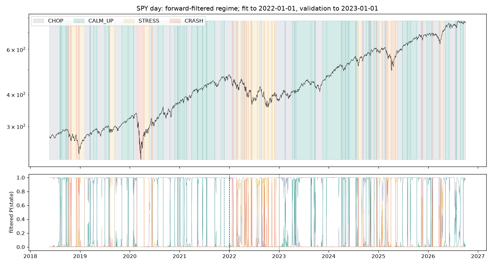

# HMM fit report: SPY day

Generated 2026-10-04T01:29+00:00. Candles 2016-01-04 to 2026-10-02 (2,703); feature rows 2,104; fit = first 912 rows (to 2022-01-01), validation 251 rows (to 2023-01-01), forward 941 rows. Features: ret, rvol, range, vol_ratio, trend (standardized on the past only).

## State count selection (BIC on fit, log-likelihood per observation on validation; simpler wins within 2%)

| k | ll | bic | oos_ll_per_obs |
|---|---|---|---|
| 2 | -4191 | 8674 | -6.794 |
| 3 | -3659 | 7781 | -6.529 |
| 4 | -3400 | 7448 | -6.312 |
| 5 | -3153 | 7152 | -6.378 |

**Chosen: 4 states**, labelled by their statistics on the fit window: CHOP, CALM_UP, STRESS, CRASH.

## Transition matrix (row = from, col = to)

| from \ to | CHOP | CALM_UP | STRESS | CRASH |
|---|---|---|---|---|
| CHOP | 0.945 | 0.0447 | 0 | 0.0103 |
| CALM_UP | 0.0499 | 0.9501 | 0 | 0 |
| STRESS | 0.0355 | 0 | 0.9372 | 0.0273 |
| CRASH | 0 | 0 | 0.1245 | 0.8755 |

## Expected duration (candles) = 1 / (1 - self-transition)

| state | expected_duration | share_fit |
|---|---|---|
| CHOP | 18.2 | 0.4397 |
| CALM_UP | 20 | 0.3695 |
| STRESS | 15.9 | 0.1283 |
| CRASH | 8 | 0.0625 |

## Per-state statistics by segment, on the forward-filtered state (what a decision would have seen)

`next_ret_bps` = mean return of the candle AFTER the state was read: the only number that can be traded.

| segment | state | share | mean_ret_bps | vol_bps | next_ret_bps | n |
|---|---|---|---|---|---|---|
| fit | CHOP | 0.4397 | 6.486 | 96.54 | 9.882 | 401 |
| fit | CALM_UP | 0.3695 | 14.22 | 50.71 | 5.279 | 337 |
| fit | STRESS | 0.1283 | 21.01 | 126.4 | 8.323 | 117 |
| fit | CRASH | 0.0625 | -74.61 | 387.7 | -19.88 | 57 |
| validation | CHOP | 0.2988 | -25.12 | 111.9 | -31.2 | 75 |
| validation | STRESS | 0.6096 | 10.77 | 145.5 | 1.639 | 153 |
| validation | CRASH | 0.09163 | -83.98 | 252.3 | -7.71 | 23 |
| forward | CHOP | 0.424 | 1.398 | 91.51 | 9.959 | 399 |
| forward | CALM_UP | 0.4548 | 11.09 | 56.89 | 1.712 | 428 |
| forward | STRESS | 0.07333 | 34.08 | 98.31 | 26.28 | 69 |
| forward | CRASH | 0.04782 | -14.73 | 249 | 11.7 | 45 |

Filtered-state switches over the whole series: 196 (9.3% of candles). Mean normalized entropy 0.066; share of candles with entropy > 0.5: 0.4%.

